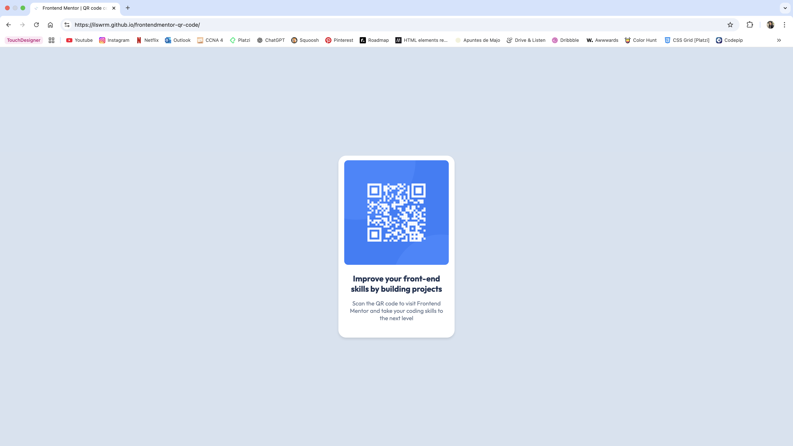

# Frontend Mentor - QR code component solution

This is a solution to the [QR code component challenge on Frontend Mentor](https://www.frontendmentor.io/challenges/qr-code-component-iux_sIO_H). Frontend Mentor challenges help you improve your coding skills by building realistic projects. 

## Table of contents

- [Overview](#overview)
  - [Screenshot](#screenshot)
  - [Links](#links)
  - [Built with](#built-with)
  - [What I learned](#what-i-learned)
- [Author](#author)

## Overview

### Screenshot

### Links
- Live Site URL: https://ilswrm.github.io/frontendmentor-qr-code/

### Built with

- Semantic HTML5 markup
- CSS custom properties
- Flexbox

### What I learned

This was my first Frontend Mentor challenge and I learned a lot from it! 
I reinforced my understanding of basic HTML structure and how to center elements using Flexbox. 
It also helped me practice organizing my files more clearly and get comfortable using Git and GitHub. 
I also release my first project with GitHub Pages which felt like a big win!

## Author
- Frontend Mentor - [@ilswrm]

